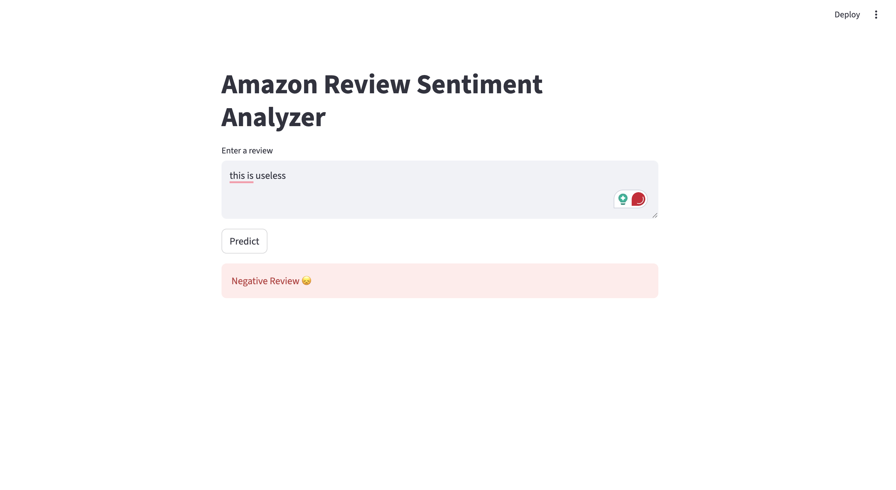

# Amazon Review Sentiment Analysis

End-to-end NLP project that builds a binary sentiment classifier for Amazon product reviews using classical machine learning.

---

## 📌 Project Highlights

- Text preprocessing & label engineering
- TF-IDF vectorization (unigrams + bigrams)
- Logistic Regression with class imbalance handling
- Evaluated using F1-score & Stratified Cross-Validation
- Deployed via Streamlit

---

## 📊 Model Performance

- Accuracy: ~94%
- F1 (minority class): ~0.90
- Cross-validated F1: ~0.89–0.90

---

## 🛠 Tech Stack

- Python
- Scikit-learn
- Pandas
- Streamlit
- Joblib

---

## 🚀 Run Locally

```bash
pip install -r requirements.txt
cd app
streamlit run app.py
# Amazon Review Sentiment Analysis

End-to-end NLP project that builds a binary sentiment classifier for Amazon product reviews using classical machine learning.

---

## 📌 Project Highlights

- Text preprocessing & label engineering
- TF-IDF vectorization (unigrams + bigrams)
- Logistic Regression with class imbalance handling
- Evaluated using F1-score & Stratified Cross-Validation
- Deployed via Streamlit

---

## 📊 Model Performance

- Accuracy: ~94%
- F1 (minority class): ~0.90 


- Cross-validated F1: ~0.89–0.90

---

## 🛠 Tech Stack

- Python
- Scikit-learn
- Pandas
- Streamlit
- Joblib

---

## 🚀 Run Locally

```bash
pip install -r requirements.txt
cd app
streamlit run app.py
---

## 📷 Demo



